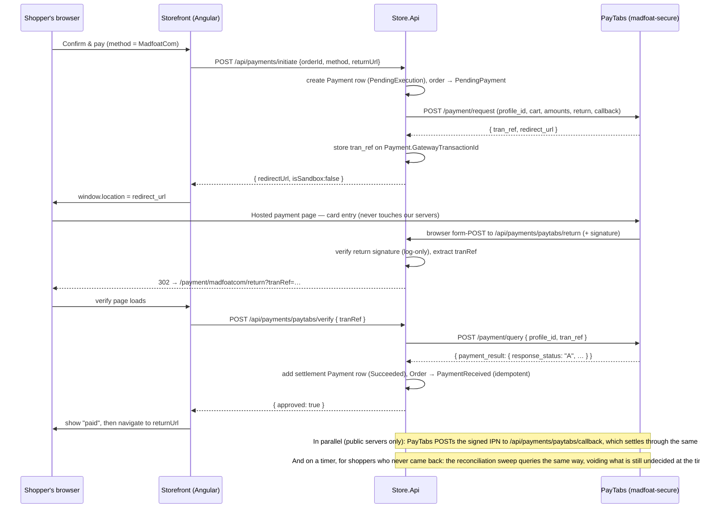

# Madfoat.com Payment Method — Technical Reference

How the **MadfoatCom** payment method is implemented in MyStore, what talks to what, and why each
piece exists. Written for a developer who has to maintain, extend, or debug the integration.

> **TL;DR** — MadfoatCom is a real integration against **PayTabs' Hosted Payment Page (HPP)** API,
> served from Madfoat's **white-label PayTabs instance**. The shopper is redirected to a
> Madfoat-branded page hosted by PayTabs, pays there, and is redirected back. Our server never sees
> card data. Settlement never trusts the browser: it always re-queries PayTabs for the authoritative
> transaction status.

---

## 1. The environment (hard-won facts)

| Fact | Value | Why it matters |
|---|---|---|
| API origin | `https://madfoat-secure.paytabs.com` | This is a **white-label shard**. The profile's keys are *unknown* to every standard PayTabs region (`secure.paytabs.com`, `secure-jordan.paytabs.com`, …) — calling any of them returns `{"code":1,"message":"Authentication failed"}`, which looks like a bad key but means **wrong host**. |
| Merchant dashboard | `https://madfoat-merchant.paytabs.com/merchant/login` | Rule of thumb: swap `-merchant` for `-secure` to get the API host. |
| Profile | ID **47255** ("crc"), merchant 1897, **Test mode** | Test mode still makes live API calls; "sandbox" means test cards only, not a simulated flow. |
| Currency | **JOD only** | Any other currency fails with `code 206 "Currency not available"`. JOD is a three-decimal currency (`20.000`). |
| API keys | Dashboard → **Developers → API Keys** | A key is scoped by permission. Use a Standard key with **Query** enabled (the one titled *"Test API Key"*). A key without Query can create pages but settlement fails with `"Transaction Query not permitted with this key"`. SDK/Mobile keys do not work for server API calls. |
| Test card | `4111 1111 1111 1111`, any future expiry, CVV `123` | Authorises in test mode. |

**Secrets policy:** the server key is not only an API credential — it is also the HMAC key for
signature verification. It exists **only** in the `PaymentProvider.AdditionalSettings` JSON in the
database (entered through the admin UI), never in source, config files, or docs.

---

## 2. Code map

### Backend (`Store.Application` / `Store.Api`)

| File | Role |
|---|---|
| `Store.Application/Payments/PayTabs/PayTabsRegions.cs` | Region code → API origin map. `MADFOAT` (the default) → `https://madfoat-secure.paytabs.com`; the seven standard PayTabs regions are also listed for portability. |
| `Store.Application/Payments/PayTabs/PayTabsModels.cs` | Request/response records (`PayTabsPageRequest`, `PayTabsPage`, `PayTabsTransaction`), `PayTabsResponseStatus` constants, `PayTabsException`. |
| `Store.Application/Payments/PayTabs/IPayTabsClient.cs` / `PayTabsClient.cs` | HTTP client. Singleton over one long-lived `HttpClient`. Two operations: `CreateHostedPageAsync` (`POST /payment/request`) and `QueryTransactionAsync` (`POST /payment/query`). |
| `Store.Application/Payments/PayTabs/PayTabsSignature.cs` | Both signature-verification schemes (see §5). Security-critical. |
| `Store.Application/Payments/GatewaySettings.cs` | Parses provider `AdditionalSettings` JSON → typed settings (`PayTabsProfileId`, `PayTabsServerKey`, `PayTabsRegion`, …). |
| `Store.Application/Payments/GatewayPaymentService.cs` | Orchestration: `CreatePayTabsPageAsync` (initiate) and `SettlePayTabsTransactionAsync` (settle). Provider id constant `MadfoatCom`. |
| `Store.Api/Controllers/PaymentsController.cs` | The three public endpoints: `paytabs/return`, `paytabs/verify`, `paytabs/callback`. |
| `Store.Api/Infrastructure/PaymentReconciliationService.cs` | Timer that runs `ReconcilePendingPayTabsPaymentsAsync` (§4, step 7) so settlement never depends on the shopper's browser or on a deliverable IPN. |
| `tests/Store.Application.Tests/PayTabsSettlementTests.cs` | 12 tests over settlement and the sweep: settlement rows, idempotency, the timeout void + restock, and the "don't void when PayTabs is unreachable" rule. |
| `tests/Store.Application.Tests/PayTabsSignatureTests.cs` | 22 tests pinning the signature schemes against digests computed by an **independent** implementation (Node `crypto`) — they assert agreement with PayTabs' spec, not self-consistency. |

### Frontend (`web/`)

| File | Role |
|---|---|
| `projects/storefront/.../checkout/payment-madfoatcom-return.{ts,html,scss}` | Landing page after the gateway redirect (`/payment/madfoatcom/return`). Reads `tranRef` from the query, calls the verify endpoint, shows paid/failed, then navigates on. |
| `projects/admin/.../payments/payment-madfoatcom-form.{ts,html}` | Admin config form (route `payments/MadfoatCom`, registered **before** the generic `payments/:id`). Serialises to the provider's `additionalSettings` JSON. |
| `projects/data-access` (`models.ts`, `payments.service.ts`) | `PayTabsVerifyRequest` + `paytabsVerify()` → `POST /api/payments/paytabs/verify`. |

### Configuration

Provider row `PaymentProvider.Id = 'MadfoatCom'`, with `AdditionalSettings` shaped like:

```json
{
  "profileId": "47255",
  "serverKey": "<from dashboard — key WITH Query permission>",
  "clientKey": "<from dashboard — unused by HPP, kept for future browser-side flows>",
  "region": "MADFOAT",
  "currency": "JOD",
  "isSandbox": true,
  "paymentFee": 0
}
```

`Payments:PublicApiBaseUrl` (in `appsettings.*.json`) is the origin PayTabs redirects/calls back to.
On localhost the IPN callback is **omitted automatically** (see §4, step 3).

The rest of the `Payments` section tunes the reconciliation sweep (§4, step 7):

| Key | Default | Meaning |
|---|---|---|
| `PendingPaymentTimeoutMinutes` | `30` | How long an attempt may stay undecided before it is voided (Payment status **40**) and its order canceled + restocked. |
| `ReconciliationIntervalSeconds` | `60` | How often the sweep runs (floored at 10 s). |
| `ReconciliationGraceMinutes` | `2` | How long an attempt is left alone before the sweep queries it, so it doesn't race a shopper still on the hosted page. |
| `ReconciliationEnabled` | `true` | Kill switch — off leaves settlement to the return leg and the IPN alone. |

---

## 3. The payment cycle



---

## 4. Step-by-step, with the decisions that matter

### Step 1 — Initiate (`GatewayPaymentService.CreatePayTabsPageAsync`)

- Guard rails first: order must exist, belong to the caller, and be `New`/`PendingPayment`; the
  provider must be enabled and hold a profile id + server key.
- A `Payment` row is created **before** calling PayTabs, so a failed gateway call leaves an
  auditable `PendingExecution` attempt and the order stays retryable.
- **`cart_id` is `"{orderId}-{paymentId}"`** — unique per attempt. PayTabs rejects a `cart_id` it
  has already seen, so using the order id alone would block a shopper retrying after a decline.
- `profile_id` is coerced to an **integer** (`PayTabsClient.ParseProfileId`) — sending it as a
  string is a classic cause of auth failures.
- Amounts are rounded to the currency's minor units (3 for JOD) — excess precision is rejected.
- `customer_details`/`shipping_details` are projected from the order's shipping address.
  **`state` is deliberately omitted**: PayTabs normalises it to a 2-letter code, our governorate
  names are Arabic, and with `hide_shipping` the page never displays it — sending it can only cause
  a validation failure. (PayTabs' own page asks the shopper for State/Region if its rules need it.)
- `paypage_lang` follows the request culture (`ar`/`en`).
- The returned `tran_ref` is persisted on `Payment.GatewayTransactionId`. This is the join key for
  everything that follows — and because PayTabs issues it and it is unguessable, presenting it also
  proves the caller took part in this payment.

### Step 2 — Authentication to PayTabs (`PayTabsClient.PostAsync`)

The server key goes **verbatim** into the `authorization` header — no `Bearer` scheme. That fails
.NET's typed-header validation, hence `TryAddWithoutValidation`. PayTabs reports validation errors
as `{code, message}` JSON with *either* 200 or 4xx, so the body is always read and the HTTP status
alone is never the verdict.

### Step 3 — Return vs. callback URLs

Two distinct legs with different trust levels:

- **`return`** — where PayTabs form-POSTs the *shopper's browser*. No SPA route can accept a
  cross-origin POST, so it targets the API (`/api/payments/paytabs/return`), which redirects on to
  the storefront. A localhost return URL is accepted by PayTabs (it only has to work in the
  shopper's browser).
- **`callback`** — PayTabs' server-to-server IPN (`/api/payments/paytabs/callback`). PayTabs
  **validates this URL at page-creation time and rejects loopback hosts** with
  `code 210 "Invalid Callback URL"`. Since PayTabs' servers could never reach localhost anyway, the
  callback is **omitted entirely when `PublicApiBaseUrl` is a loopback address**
  (`GatewayPaymentService.IsLoopback`) — settlement then rides on the return leg plus the reconciliation
  sweep (§4, step 7), which is exactly why that sweep exists. On a public
  deployment it is sent, giving a settlement path that works even if the shopper closes the tab.

### Step 4 — Return endpoint (`PaymentsController.PayTabsReturn`)

Accepts POST (normal) and GET (some redirect variants). It:

1. Reads the gateway's fields — from the form body when present, otherwise from the query string
   **excluding our own `orderId`/`returnUrl` parameters** (PayTabs never signed those; folding them
   in would make every legitimate signature fail).
2. Verifies the return signature — **for logging only**. A mismatch logs a warning but still
   redirects, because this endpoint changes no state and settlement re-queries PayTabs regardless.
   A forged return therefore buys an attacker nothing.
3. 302-redirects the browser to the storefront verify page with `tranRef`.

### Step 5 — Settlement (`GatewayPaymentService.SettlePayTabsTransactionAsync`)

Single funnel used by the storefront verify call, the IPN, **and** the reconciliation sweep (step 7).
Rules:

- **Always re-query PayTabs** (`POST /payment/query`). The browser redirect is
  attacker-controllable and the IPN body is only as trustworthy as its signature; PayTabs' own
  answer is the only thing settlement acts on. This requires the key's **Query** permission.
- **Two rows per transaction.** The verdict is written as a *new* `Payment` row rather than
  overwriting the attempt: the attempt row keeps `PendingExecution` (-10) as the record of "the
  shopper was sent to the gateway", and the row added here carries the outcome, PayTabs' message and
  the same `tran_ref`. The payments log therefore reads **attempt → outcome** per transaction, and a
  retry after a decline adds its own pair.
- **Idempotent**: if a `Succeeded` row already exists for the `tran_ref`, return it without querying
  or writing — the return page, the IPN and the sweep routinely race.
- Status mapping (`payment_result.response_status`):

  | Status | Meaning | Action |
  |---|---|---|
  | `A` (Authorised), `H` (Hold) | Paid | Settlement row `Succeeded` (20), Order → `PaymentReceived` |
  | `P` (Pending) | Undecided (async method / shopper mid-flow) | **Write nothing** — a later IPN, revisit or sweep can still settle; failing now would strand an order about to be paid |
  | `D`/`C`/`V`/`E`/`X` (Declined/Cancelled/Voided/Error/Expired) | Failed | Settlement row `Failed` (10) with PayTabs' message; **order → `PaymentFailed` (35)**, which is both what the shopper is shown and a status they can pay again from (step 8) |

One deliberate exception: if a query comes back approved for an order the timeout (step 7) has
already canceled, the `Succeeded` row is still recorded — the money is real — but the canceled order
is **not** reinstated, since its stock has gone back. That case logs an error and adds an order-history
note for a human to refund or reinstate.

### Step 6 — IPN callback (`PaymentsController.PayTabsCallback`)

- Reads the **raw** request body, verifies the `signature` HTTP header (HMAC of those exact bytes),
  and returns **400** on mismatch — this endpoint *does* gate on the signature because it has no
  browser context at all.
- On a valid signature it extracts `tran_ref` and settles through the same funnel (still
  re-querying — a valid signature proves PayTabs sent it, not that the body says "paid").
- Returns 200 for anything it cannot act on (unconfigured provider, missing tran_ref) so PayTabs
  stops retrying.

### Step 7 — Reconciliation sweep (`GatewayPaymentService.ReconcilePendingPayTabsPaymentsAsync`)

Runs on a timer from `Store.Api/Infrastructure/PaymentReconciliationService.cs`, and exists because
**neither the return leg nor the IPN is guaranteed**: a shopper can pay and close the tab instantly,
and the IPN is not requested at all on localhost and can be blocked or dropped on a real host.
Without it such a payment sits at `PendingExecution` forever with the money taken — and an abandoned
checkout holds its stock indefinitely.

Each pass picks up MadfoatCom attempts that are still `PendingExecution`, older than the grace
period, whose **order is still `PendingPayment` or `PaymentFailed`**, and for which no settlement row
already carries the same `tran_ref`. For each one:

1. Re-query through the step-5 funnel. Approved or declined → a settlement row is written and the
   attempt is done.
2. Still `P` (or no `tran_ref` at all, i.e. page creation failed) **and past the timeout** →
   settlement row `Voided` (**40**), order → `Canceled` (80) via `IOrderService.CancelOrderAsync`,
   which **restocks** every stock-tracked line.
3. If the *query itself* failed (PayTabs unreachable), nothing is voided — cancelling a shopper's
   order over a network blip is worse than waiting for the next pass.

Only an order's **newest** attempt can be voided. A shopper who abandons one hosted page and starts
again leaves a stale attempt that ages past the timeout while they are still paying on the new one;
voiding it would cancel the order mid-payment.

A second pass then releases orders that were **abandoned after a decline**: `PendingPayment` /
`PaymentFailed`, untouched since before the timeout, with a MadfoatCom payment, no successful one,
and nothing left in flight (the newest payment row is a settlement, not an attempt). There is no
pending attempt to void, so only the order is canceled and restocked. Without it a `PaymentFailed`
order would hold its stock forever, because its attempt already carries a settlement row.

Tuned by the `Payments` config keys in §2 (defaults: query after 2 min, void after 30 min, sweep
every 60 s). Assumes a single API process; scaling out would want a lease so two instances don't
sweep the same rows. `tests/Store.Application.Tests/PayTabsSettlementTests.cs` pins all of it.

### Step 8 — Paying again (`OrderService.RetryPaymentAsync`)

A declined card leaves the order at `PaymentFailed` (35), which the storefront shows with a **Pay
again** button (`shared/retry-payment.ts`, on the account order card and order detail).
`POST /api/orders/{id}/retry-payment` decides what happens, and it is the server that checks stock —
never the browser:

| Situation | Result |
|---|---|
| Every line still orderable | `canPay` — the storefront calls `/api/payments/initiate` for the **same order** and the shopper is sent back to the hosted page. `InitiatePaymentAsync` accepts `PaymentFailed` for exactly this. |
| Anything withdrawn or short on stock | `movedToCart` — **all** lines are copied to the cart, the order is canceled (returning its stock), and the storefront navigates to `/cart` |

Availability counts the order's own stock when the order still holds it (anything but `Canceled`),
so a retry never reports its own reservation as missing. A canceled order (the timeout, or an admin)
is never revived — its lines always go back to the cart instead.

Lines that came back unavailable stay in the cart **for information only**: `CartItemModel.IsAvailable`
is false, `CartService` leaves them out of `SubTotal` and the coupon/discount maths, and the cart page
greys them out, shows "no longer available" or "only N left", and blocks checkout until they are
removed. Cart quantities are *raised* to the ordered amount rather than added to it, so a
double-clicked retry cannot double the bag. `tests/Store.Application.Tests/OrderRetryPaymentTests.cs`
covers all of it.

Guests are out of scope: the endpoint is authenticated, and a guest's cart lives in their browser.

---

## 5. Signature verification (`PayTabsSignature`)

PayTabs uses **two different schemes**, both HMAC-SHA256 keyed with the **server key**:

1. **Callback / IPN** — digest of the **raw request body bytes**, sent in the `signature` HTTP
   header. Hash before any JSON parse/re-serialise round trip: the digest covers bytes, not JSON
   semantics.
2. **Return** — digest of a canonical string rebuilt from the posted fields, sent as a `signature`
   *form field*. The canonical string reproduces PayTabs' PHP reference exactly:
   - `array_filter`: drop `null`, `""` **and the literal string `"0"`** (PHP falsiness — the
     easiest thing to get wrong in a port);
   - `ksort`: ordinal key sort;
   - `http_build_query`/`urlencode`: space → `+`, `~` and `/` escaped, `-` `_` `.` left alone,
     UTF-8 bytes as upper-case percent-hex;
   - the `signature` field itself is excluded from the digest.

Both verifiers compare in constant time (`CryptographicOperations.FixedTimeEquals` over decoded
bytes), return `false` (never throw) on malformed hex, and **fail closed** when no server key is
configured. The unit tests pin all of this against independently computed digests — in the first
live transaction the return signature verified on the first attempt.

---

## 6. Error catalogue (observed, not theoretical)

| Response | Real meaning | Fix |
|---|---|---|
| `code 1` — "Authentication failed. Check authentication header." | **Wrong API host** for this profile (white-label vs. regional), or genuinely wrong/SDK key. PayTabs rejects the key before even looking at the profile — a bogus profile id produces the byte-identical error. | Use `https://madfoat-secure.paytabs.com`; use a Standard (not SDK) key. |
| `code 206` — "Currency not available" | Profile not enabled for that currency. | Use `JOD`. |
| `code 210` — "Invalid Callback URL" | Callback URL is loopback/unreachable — validated at page creation. | Automatic: callback omitted on localhost. On servers, `PublicApiBaseUrl` must be the public HTTPS origin. |
| `code 1` — "Transaction Query not permitted with this key" | Key lacks the **Query** permission. Pages get created; settlement fails. | Use the key with Query enabled (dashboard → Developers → API Keys). |
| Verify returns 400 "Payment not found for this transaction." | `tranRef` matches no stored `Payment.GatewayTransactionId`. | Expected for forged/unknown refs. |

---

## 7. Testing it locally

1. API on `https://localhost:7142`, storefront on `:4200` (see `CLAUDE.md`).
2. Admin → **Payments → MadfoatCom**: enable, set profile id + server key (Query-enabled key),
   region `MADFOAT`, currency `JOD`.
3. Storefront: add to cart → checkout → select **MadfoatCom** → Confirm & pay → you land on the
   Madfoat-branded hosted page (yellow **TEST MODE** badge).
4. Pay with `4111 1111 1111 1111`, future expiry, CVV `123` (fill State/Region if the page asks).
5. You are redirected back through `/api/payments/paytabs/return` →
   `/payment/madfoatcom/return` → verify → order shows **Payment received**.
6. Cross-check in the merchant dashboard: Transactions list shows the `TST…` ref with status **A**.

Run the signature test suite with
`dotnet test --filter "FullyQualifiedName~PayTabsSignatureTests"` (part of the standard 142).

---

## 8. Extending

- **New white-label or region:** add one entry to `PayTabsRegions.BaseUrls` and to the `REGIONS`
  list in the admin form. Everything else keys off the stored region code.
- **Refunds/voids:** the key already carries the permissions; add operations to `IPayTabsClient`
  (`/payment/request` with `tran_type: "refund"` + `tran_ref`) and drive them from the admin order
  screen.
- **Browser-side flows (Payment SDK / managed form):** that is what the stored `clientKey` is for;
  the HPP flow never uses it.
