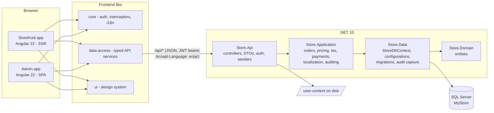

# MyStore — Technical Documentation (Developer Handoff)

**Audience:** the client's development team taking ownership of the source code.
**Goal:** after reading this document a developer can locate, understand, and safely change any part of the system.
**Repository root:** the folder containing `MyStore.slnx` (backend solution) and `web/` (Angular workspace).

---

## Table of contents

1. [What this system is](#1-what-this-system-is)
2. [Repository layout](#2-repository-layout)
3. [Technology stack and prerequisites](#3-technology-stack-and-prerequisites)
4. [Running the system locally](#4-running-the-system-locally)
5. [Backend architecture](#5-backend-architecture)
6. [API surface (route catalog)](#6-api-surface-route-catalog)
7. [Authentication and authorization](#7-authentication-and-authorization)
8. [The bilingual content system (Arabic/English)](#8-the-bilingual-content-system-arabicenglish)
9. [The audit trail](#9-the-audit-trail)
10. [Media and file uploads](#10-media-and-file-uploads)
11. [Database, EF Core and migrations](#11-database-ef-core-and-migrations)
12. [Startup seeders](#12-startup-seeders)
13. [Frontend architecture (Angular workspace)](#13-frontend-architecture-angular-workspace)
14. [The storefront app](#14-the-storefront-app)
15. [The admin app](#15-the-admin-app)
16. [Testing](#16-testing)
17. [How-to recipes (common changes)](#17-how-to-recipes-common-changes)
18. [Hard rules — read before changing code](#18-hard-rules--read-before-changing-code)
19. [Deployment](#19-deployment)
20. [Store.Migrator (one-off data tooling)](#20-storemigrator-one-off-data-tooling)
21. [Troubleshooting](#21-troubleshooting)

---

## 1. What this system is

**MyStore** is a bilingual (Arabic/English) e-commerce platform for the Jordanian market, originally derived from the open-source **SimplCommerce** project and since rebuilt as:

- a **REST API** on ASP.NET Core / **.NET 10** with SQL Server + EF Core, and
- an **Angular 22** workspace containing two applications — a customer **storefront** (server-side rendered) and an **admin** back office — plus four shared libraries.

The two halves communicate only over HTTP (`/api/...` and `/user-content/...`). There is no shared code between backend and frontend; the contract is the JSON DTOs defined in `Store.Api/Models` and mirrored in `web/projects/data-access/src/lib/models.ts`.



Domain highlights:

- Catalog (products, variations/options, attributes, categories, brands, vendors), pricing with special/sale prices, signature (featured) products.
- Cart (member and guest), coupons/cart rules, checkout, orders with vendor sub-orders, shipments, warehouse stock, tax and shipping rate tables.
- CMS: pages, menus, news (with home-page "alert" band), content blocks, contact form.
- Moderation: product reviews and comments.
- Customer accounts, wishlists, product comparison, recently-viewed.
- Full admin back office with role-based permissions and a per-entity audit trail.
- Every piece of customer-facing text is bilingual: Arabic in the base database columns, English in an overlay table (see §8 — this is the single most important concept in the codebase).

---

## 2. Repository layout

```
├── MyStore.slnx                  # .NET solution (API + 3 class libraries + tests)
├── CLAUDE.md                     # condensed contributor notes (build commands, gotchas)
├── Store.Domain/                 # entities only — no EF, no business logic dependencies
├── Store.Data/                   # DbContext, EF configurations, migrations, repositories
├── Store.Application/            # business services (orders, pricing, tax, shipping, auth, …)
├── Store.Api/                    # controllers, DTOs, DI composition, seeders, infrastructure
├── Store.Migrator/               # one-off SQL/scripts: SimplCommerce → MyStore data migration
├── tests/Store.Application.Tests # xUnit test suite (91 tests)
├── docs/                         # engineering docs (this file, code-review reports)
└── web/                          # Angular 22 workspace (see §13)
    ├── angular.json
    ├── package.json
    └── projects/
        ├── storefront/           # customer app, SSR, port 4200
        ├── admin/                # back office SPA, port 4201
        ├── core/                 # auth, interceptors, i18n, guards (lib)
        ├── data-access/          # typed API services + models (lib)
        ├── ui/                   # design-system components + global SCSS (lib)
        └── util/                 # placeholder (lib)
```

> **Deleted-but-recoverable operational docs.** Earlier revisions carried `DEPLOYMENT-RUNBOOK.md`, `instlation-Guid.md`, `MEDIA.md` and a `supported-doc/` folder (full DB schema script, catalog CSV, admin HOWTOs). They were removed from the tree in recent commits and now exist **only in git history**. Some contain environment-specific values (hostnames, server IP, SQL login, bootstrap password), so decide deliberately whether to re-include them in a client delivery. Recovery commands:
>
> ```bash
> git show d0052d3^:DEPLOYMENT-RUNBOOK.md   # + instlation-Guid.md from the same commit
> git show b6f36e6^:MEDIA.md
> git show 298c5580^:supported-doc/my_store_shema.sql   # etc.
> ```
>
> §19 of this document reproduces the deployment topology and procedure in generic form, so this file stands alone.

---

## 3. Technology stack and prerequisites

| Area | Technology | Version |
|---|---|---|
| API runtime | ASP.NET Core Web API | .NET 10 |
| ORM | Entity Framework Core (SQL Server) | 10.x |
| Database | Microsoft SQL Server | any edition reachable at `localhost` in dev |
| Identity | ASP.NET Core Identity (custom `User`/`Role` entities) | 10.x |
| Auth tokens | JWT bearer (access) + httpOnly cookie (refresh) | — |
| Payments | Stripe (+ mock sandbox gateway) | — |
| Frontend | Angular (standalone components, signals, zoneless) | 22 |
| SSR | Angular SSR (`AngularNodeAppEngine`) on Express 5, Node service | Node ≥ 22.22.3 |
| UI toolkit | ng-bootstrap + Bootstrap 5, custom `ui` library | — |
| Charts (admin) | chart.js via ng2-charts | — |
| i18n | @ngx-translate v18, JSON bundles, RTL support | — |
| Unit tests | xUnit (backend), Vitest via Angular unit-test builder (frontend) | — |

**Developer machine prerequisites**

- .NET 10 SDK
- SQL Server with a `MyStore` database (Integrated Security against `localhost` by default)
- Node.js **≥ 22.22.3** (the Angular 22 CLI hard-rejects older versions)
- `dotnet-ef` global tool for migrations (`dotnet tool install -g dotnet-ef`)

---

## 4. Running the system locally

### 4.1 Backend

```bash
# from the repository root
dotnet run --project Store.Api --launch-profile https
# API listens on https://localhost:7142 and http://localhost:5094
```

On boot the API runs its idempotent seeders (§12) and then serves requests. Dev admin login: `admin@mystore.local` / `Admin@123`.

> **Required local file:** `Store.Api/appsettings.Development.json` is **git-ignored** and must exist. It carries the connection string, JWT signing key and dev admin password (see §7 and §19 for the key list). Without it the API will not start.

### 4.2 Frontend

```bash
cd web
npm ci --legacy-peer-deps    # REQUIRED flag: ng-bootstrap@20 declares an Angular 21 peer
npm run build:libs           # REQUIRED on a fresh tree — see the library build gotcha below
ng serve storefront          # http://localhost:4200
ng serve admin               # http://localhost:4201
```

**The library build gotcha (most common trap in this repo).** `web/tsconfig.json` maps the imports `core`, `data-access`, `ui`, `util` to their **built output in `web/dist/`**, not to their sources:

```jsonc
"paths": {
  "core":        ["./dist/core"],
  "data-access": ["./dist/data-access"],
  "ui":          ["./dist/ui"],
  "util":        ["./dist/util"]
}
```

Consequences:

- Apps cannot compile until `npm run build:libs` has run at least once.
- **After changing any library source, rebuild that library** (`ng build core` etc.) or the apps keep compiling against stale output. If a change in `projects/core` "doesn't take effect", this is why.

Both dev servers proxy `/api` and `/user-content` to `https://localhost:7142` via `projects/<app>/proxy.conf.json`, so the browser sees a single origin (which the cookie-based refresh flow depends on).

### 4.3 Everyday commands

| Task | Command (where) |
|---|---|
| Build backend | `dotnet build` (root) |
| Backend tests | `dotnet test` (root) — expect 91/91 |
| One test | `dotnet test --filter "FullyQualifiedName~SomeTestName"` |
| Build all frontend | `npm run build` (web/) — lints first via `prebuild` |
| Build only libs | `npm run build:libs` (web/) |
| Lint / autofix | `npm run lint` / `npm run lint:fix` (web/) |
| Frontend tests | `ng test` (web/) — Vitest |
| Serve built SSR storefront | `npm run serve:ssr:storefront` (web/) |
| Add EF migration | `dotnet ef migrations add <Name> --project Store.Data --startup-project Store.Api` |

---

## 5. Backend architecture

### 5.1 Layering

Four projects with strictly one-directional references (`A → B` means A references B):

```
Store.Api ──────────► Store.Application ──► Store.Data ──► Store.Domain
    │                                          ▲
    └──────────────────────────────────────────┘   (Api also references Data & Domain)
```

| Project | Contains | Must NOT contain |
|---|---|---|
| **Store.Domain** | Entities (POCOs), the ASP.NET Identity `User`/`Role` model, marker interfaces (`ISeoEntity`, `ISoftDeletable`, `IAuditedEntity`) | EF Core references, business logic, DTOs |
| **Store.Data** | `StoreDbContext`, one `IEntityTypeConfiguration<T>` per entity in `Configurations/`, EF migrations, Identity stores, audit capture | Controllers, HTTP concerns |
| **Store.Application** | Business services: orders, pricing, coupons, tax, shipping, stock, catalog, auth/JWT issuance, payments (Stripe), localization read/write services, audit reader | Controllers, HTTP concerns |
| **Store.Api** | Controllers, request/response DTOs (`Models/`), DI composition root (`Program.cs`), auth policies, seeders, media storage, cross-cutting helpers (`Infrastructure/`) | Business rules that belong in Application |

Composition root: **`Store.Api/Program.cs`** registers, in order: controllers with a global `AuditActionFilter`; the `SpaCors` CORS policy (dev origins 4200/4201, credentials allowed, exposes `X-Correlation-Id`); antiforgery (`X-XSRF-TOKEN` header / `__Host-Antiforgery` cookie); `AddStoreData(configuration)` (Store.Data/DependencyInjection.cs); `PaymentsOptions`; `AddStoreApplication()` (Store.Application/DependencyInjection.cs); `IMediaStorage → LocalMediaStorage`; `AddIdentityCore<User>`; JWT bearer auth (`Jwt` section); `AddStorePolicies()`; `AdminSeedOptions`; Swagger (dev-only UI). It then awaits the seeders (§12) and builds the pipeline:

```
Swagger (dev) → HttpsRedirection (non-dev) → StaticFiles(/user-content)
→ CORS → Authentication → Authorization → Antiforgery → MapControllers
```

Two consequences worth knowing: `/user-content` files are served **before** auth (uploaded media is public by design), and **EF migrations are not applied automatically at startup** — applying schema is an explicit deploy step (§11, §19).

### 5.2 Design conventions you will see everywhere

- **No repositories or CQRS ceremony.** Controllers and services inject `StoreDbContext` directly and write intention-revealing LINQ. Reads that only feed DTOs use `.AsNoTracking()` and project with `.Select(...)`; writes load tracked entities and call `SaveChangesAsync`.
- **DTO records per endpoint.** Every response shape is a C# `record` in `Store.Api/Models` (`AdminModels.cs`, `StorefrontModels.cs`, `AuthModels.cs`, `PagedResult.cs`). Entities are never serialized directly. The Angular apps bind to these shapes — treat them as a public contract (changing one is a breaking change for `web/projects/data-access/src/lib/models.ts`).
- **Pagination.** List endpoints return `PagedResult<T>(Items, Total, Page, PageSize)` built by `ToPagedResultAsync` (`Store.Api/Infrastructure/QueryableExtensions.cs`).
- **Error shape.** Hand-rolled `BadRequest(new { error = "..." })` — the frontend expects an `error` string field.
- **Soft deletes are explicit.** Entities with `IsDeleted` (marked `ISoftDeletable`) are filtered per query (`.Where(x => !x.IsDeleted)`); admin lists expose `includeDeleted`. There are **deliberately no EF global query filters** — do not add one casually, it changes the SQL of every query (see §18).
- **Shared helpers in `Store.Api/Infrastructure`** (introduced by the 2026-07 deduplication pass, documented in `docs/architect-review.md`):
  - `AuditStampExtensions.WithAuditStampsAsync` — overlays created-by/modified-by onto admin list DTOs (§9).
  - `AdminText.NormalizeOrNull` — blank → null normalization matching overlay semantics.
  - `Moderation` — comment/review status constants (`1=Pending, 5=Approved, 8=NotApproved`; values inherited from the SimplCommerce data).
  - `UserAdminSupport` — shared customer/staff account operations (build, group assignment, soft delete).
  - `SeederSupport.EnsureCultureAsync` — seeder-only culture insert (saves immediately).
  - `OrderMapping` — order → DTO projections plus `IncludeDetail()` (the standard order include chain).
  - `RequestCulture` — resolves the request's overlay culture (§8).
  - `Slug` — slug generation for catalog/CMS entities.

### 5.3 Where business logic lives (`Store.Application`)

| Folder | Service | Responsibility |
|---|---|---|
| `Orders/` | `OrderService` | Creates orders from a `Checkout` snapshot: validates stock/coupon/shipping, computes tax (`BuildOrderItemAsync`), creates vendor **sub-orders** (master order marked `IsMasterOrder`, children linked via `ParentId`), decrements stock, generates the unique 6-digit tracking number, cancellation restocking |
| `ShoppingCart/` | `CartService` | Member cart lines, cart detail with pricing + coupon application |
| `Pricing/Coupons/` | `CouponService` | Coupon validation (activity window, per-coupon and per-customer usage limits, product/category scoping, `cart_fixed` vs `by_percent`), usage recording |
| `Catalog/` | `CatalogService` | Storefront product listing/filtering/sorting, product detail with variations, signature products; `Pricing/` holds `IProductPricingService` (special-price windows) |
| `Tax/` | `TaxService` | Tax percent lookup by tax class + destination |
| `Shipping/` | `DbShippingPriceService` | Applicable shipping methods/prices from the `PriceAndDestination` rate table |
| `Inventory/` | `StockService` | Warehouse stock adjustments + `StockHistory` audit rows |
| `Auth/` | token issuance | JWT creation, refresh-token handling (see §7) |
| `Payments/` | Stripe integration | Payment intent/session creation, status updates (see §7.4) |
| `Localization/` | `LocalizationService`, `LocalizedContentWriter` | Overlay reads and staged writes (§8) |
| `Auditing/` | `AuditService`, `AuditStampReader` | Audit log write model + batched created-by/modified-by reads (§9) |
| `Common/` | `Result`/`Result<T>` | Success/failure return type used instead of exceptions for business failures |

**Money/tax invariants** (protected by `OrderTotalsTests`): order line prices are stored tax-exclusive; when `IsProductPriceIncludeTax` is set the tax is stripped out (`price /= 1 + taxPercent/100`); the master order uses the *calculated* (special/sale) price as line base while vendor sub-orders use the raw `Product.Price` — this asymmetry is intentional, do not "fix" it.

---

## 6. API surface (route catalog)

All routes are attribute-routed. Storefront (anonymous or customer-token):

| Route | Controller | Purpose |
|---|---|---|
| `/api/auth/*` | `AuthController` | login, register, refresh, logout |
| `/api/account/*` | `AccountController` | profile, addresses, password |
| `/api/catalog/*` | `CatalogController` | product lists, product detail, categories, brands, search |
| `/api/cart/*` | `CartController` | member cart CRUD, coupon apply/remove |
| `/api/checkout/*` | `CheckoutController` | shipping options + place order; `guest/*` variants for guest checkout |
| `/api/orders/*` | `OrdersController` | my orders, order detail, public `track` by tracking number |
| `/api/payments/*` | `PaymentsController` | payment provider list, Stripe session/mock gateway |
| `/api/wishlist`, `/api/comparison`, `/api/recently-viewed` | respective controllers | customer product lists |
| `/api/locations/*` | `LocationsController` | countries/provinces/districts for address forms |
| `/api/pages/{slug}`, `/api/news*`, `/api/home/alerts`, `/api/content/blocks/{pageKey}`, `/api/contact*` | `ContentController` | CMS content, localized via overlay |
| `/api/products/{id}/reviews*` | `ProductReviewsController` | review read/submit |

Admin (staff JWT + policy per area, all under `/api/admin/*`): `brands, categories, comments, contacts, customer-groups, customers, dashboard, inventory, localization, locations, media, menus, news, orders, pages, payments, product-attributes, product-options, product-templates, products, promotions, reviews, settings, shipments, shipping, system-logs, tax, users, vendors, warehouses, audit-logs, content-blocks` — one controller each in `Store.Api/Controllers/Admin/`, named `Admin<Area>Controller`.

Swagger is enabled in development — browse `https://localhost:7142/swagger` for the live, always-accurate contract.

---

## 7. Authentication and authorization

### 7.1 Token model (access JWT + rotating refresh cookie)

Endpoints: `AuthController` (`/api/auth/register|login|refresh|logout|xsrf`); profile read/update is `AccountController` (`/api/account/me`).

- **Access token:** HMAC-SHA256 JWT issued by `JwtTokenService` (`Store.Application/Auth`). Claims: `sub` (user id), `jti`, `name`, `email`, one `ClaimTypes.Role` per role. Lifetime `Jwt:ExpiryMinutes` (default 60), clock skew 30s. The frontend keeps it **in memory only**.
- **Refresh token:** 256-bit random hex from `RefreshTokenService`; only its **SHA-256 hash** is stored (`User.RefreshTokenHash` + `RefreshTokenExpiresAt`, default lifetime `Jwt:RefreshTokenDays` = 14). The raw value travels exclusively in the **`refresh_token` httpOnly cookie** (Secure, SameSite=Strict, path `/api/auth` — see `Store.Api/Infrastructure/AuthCookies.cs`). The token **rotates on every issue**; `logout` clears hash + cookie. Comparison is constant-time (`FixedTimeEquals`).
- **Session restore:** page reload → frontend POSTs `/api/auth/refresh` with credentials → API validates the cookie hash → new JWT + new refresh cookie. This is why dev proxy / prod reverse proxy must keep everything same-origin.
- **XSRF:** antiforgery cookie `__Host-Antiforgery` + JS-readable `XSRF-TOKEN` cookie, header `X-XSRF-TOKEN`; the auth endpoints themselves are `[IgnoreAntiforgeryToken]`. `UseAntiforgery` runs after auth in the pipeline.
- Staff logins are written to the audit log (`Action = "Login"`); customer logins are not.

### 7.2 Roles and policies

Roles (`Store.Api/Infrastructure/AppRoles.cs`): `super-admin`, `admin`, `sales-manager`, `sales`, `warehouse-keeper`, `content-writer`, `customer`. `AppRoles.Staff` = the six non-customer roles — this is the split that also separates the admin **Users** screen (staff) from the **Customers** screen (everyone else).

Authorization is pure role-based policies (`Store.Api/Infrastructure/AuthPolicies.cs`, registered by `AddStorePolicies`). Policy names are `area:<name>`: `catalog, content, moderation, media, inventory, fulfillment, shipments-view, sales, orders-view, vendors, marketing, taxes, payments, reports, settings, users`. `super-admin` and `admin` are in every policy; e.g. Catalog adds `warehouse-keeper`, Content/Moderation add `content-writer`, Sales adds `sales`/`sales-manager`, and Taxes/Reports/Settings/Users are admin-only.

**Mirror rule:** the admin app's `AREA` map in `web/projects/admin/src/app/core/roles.ts` duplicates this table for menu/guard purposes. Any policy change must touch both files.

### 7.3 Identity configuration

`AddIdentityCore<User>` in `Program.cs` with a deliberately relaxed password policy (min length 4, no character-class requirements — matches migrated legacy accounts), `RequireUniqueEmail = true`. Password hashes from SimplCommerce keep working (`PasswordHashCompatibilityTests` pins this). Registration/creation flows go through `UserManager` so security stamps stay consistent.

### 7.4 Payments (Stripe + gateway stub)

- `PaymentsController` (`/api/payments`): `GET methods` (anonymous), `POST initiate` (authorized), `POST guest/initiate` (anonymous, validated against the order's `GuestEmail`), `POST callback` (gateway signature), `POST stripe/verify`, `POST stripe/webhook` (verified with the provider's webhook secret via the `Stripe-Signature` header).
- `GatewayPaymentService` (`Store.Application/Payments`) implements a two-leg initiate → callback/verify → settle flow shared by Stripe, PayPal Express and MEPS entries; sandbox mode simulates approval, live Stripe creates a real Checkout Session (`StripeClient` wraps the Stripe SDK).
- **Where the keys live:** *not* in appsettings. Each provider row (`PaymentProvider.AdditionalSettings`, editable in admin → Payments) carries a JSON blob — `publicKey`, `secretKey`, `webhookSecret`, `currency` (default `jod`), `isSandbox`, fees — parsed by `GatewaySettings`. Host config contributes only `Payments:StorefrontBaseUrl` (the return-URL base, default `http://localhost:4200`).

### 7.5 Configuration keys (complete list)

The backend binds exactly four configuration sections — there are no ad-hoc `Configuration["..."]` reads:

| Key | Purpose | Where set |
|---|---|---|
| `ConnectionStrings:DefaultConnection` | SQL Server | Development/Production json (git-ignored) |
| `Jwt:Key` (≥ 32 chars), `Jwt:Issuer`, `Jwt:Audience`, `Jwt:ExpiryMinutes`, `Jwt:RefreshTokenDays` | token signing/validation | Key in git-ignored file; the rest default in `appsettings.json` (`MyStore` / `MyStoreClients` / 60 / 14) |
| `AdminUser:Email`, `AdminUser:FullName`, `AdminUser:Password` | bootstrap super-admin seeding | Password in git-ignored file — **if absent, admin seeding is silently skipped** |
| `Payments:StorefrontBaseUrl` | payment return URLs | per environment |

---

## 8. The bilingual content system (Arabic/English)

**This is the most important custom concept in the codebase.** Read this section before touching any admin CRUD or storefront content endpoint.

### 8.1 Data model

- Base entity columns (`Product.Name`, `Category.Description`, `Page.Body`, …) hold **Arabic** — the site's default culture.
- English text lives in one overlay table: **`LocalizedContentProperty`** — `(EntityType, EntityId | EntityKey, CultureId, ProperyName, Value)`. (Note: `ProperyName` — a historical misspelling that carries through; keep it.)
- Culture ids: `en-US` for English overrides, `arabic` for Arabic overrides of rows whose base text isn't fully Arabic. Constants: `RequestCulture.EnglishCultureId` / `ArabicCultureId` (`Store.Api/Infrastructure/RequestCulture.cs`).
- Entity/property name constants: `LocalizedEntity.*` and `LocalizedProperty.*` (`Store.Application/Localization`).

### 8.2 Read path (storefront)

1. The Angular app sends `Accept-Language: en` or `ar` on every request (core library's `acceptLanguageInterceptor`).
2. The controller calls `RequestCulture.OverlayCultureId(Request)` → `"en-US"`, `"arabic"`, or `null` (serve base columns).
3. It loads the rows, then calls `ILocalizationService.GetOverlayAsync(entityType, ids, cultureId, ct)` → a `LocalizedOverlay`, and re-projects DTOs with `overlay.Apply(id, property, baseValue)` (falls back to the base value when no override exists).

### 8.3 Write path (admin)

Admin upsert requests carry paired fields: `Name` (Arabic, base column) + `NameEn` (English, overlay), etc. Controllers write the entity, then stage overlay changes:

- `ILocalizedContentWriter.SetAsync / SetManyAsync` upserts one/many overlay rows, or **removes the row when the value is blank** (blank = "no English override; show Arabic").
- **Staged, not saved:** the writer never calls `SaveChangesAsync`. The controller saves once, so entity + overlays commit in one transaction. Do not add a save inside the writer.
- On hard delete call `RemoveAllAsync` so overlay rows don't orphan.

The admin UI edits both languages side-by-side via the `multi-lang-input` shared component (`web/projects/admin/src/app/shared/`).

### 8.4 UI translations vs content translations

Do not confuse the two systems: static UI strings (buttons, labels) come from `@ngx-translate` JSON bundles in each app's `src/assets/i18n/{en,ar}.json`; **data** (product names, pages, news) comes from the overlay system above. Adding a new admin screen usually means touching both.

---

## 9. The audit trail

The pipeline has two cooperating layers:

1. **Change capture (data layer).** `StoreDbContext.SaveChanges/SaveChangesAsync` snapshots every Added/Modified/Deleted entry from the ChangeTracker into a scoped `IAuditContext` buffer *before* saving (`Store.Data/StoreDbContext.cs`, `Store.Data/Auditing/`). It records entity type, state, id, a display name (first non-empty of Name/Title/OrderNumber/Code/Slug/Email/UserName) and old/new scalar values. Sensitive properties are excluded by `AuditSecrets` (PasswordHash, SecurityStamp, RefreshTokenHash, anything matching password/secret/token/apikey). No-op "modifications" are skipped.
2. **Entry writing (API layer).** The global `AuditActionFilter` (`Store.Api/Infrastructure`) runs after each action: for a **successful 2xx admin write** (`/api/admin/*` POST/PUT/PATCH/DELETE) that actually changed data, it combines the captured changes with the JWT actor, the functional area (derived from the endpoint's `area:*` policy), client IP and `X-Correlation-Id`, and persists an **`AuditLog`** row via `AuditService`. It is best-effort (never fails the request). `[SkipAudit]` opts an action out — used where an endpoint writes its own richer entry (e.g. stock-out); services outside the filter (e.g. staff login) log via `AuditActorFactory` + `IAuditService` directly.

**Read side:** most entities have no `CreatedBy` columns. Admin lists derive "created by / modified by" from the log via `IAuditStampReader.ReadAsync(entityType, ids, ct)` — one batched query per list — overlaid onto DTOs with `result.WithAuditStampsAsync(...)` (`Store.Api/Infrastructure/AuditStampExtensions.cs`). Rows that predate auditing (seeded/migrated data) legitimately show blank stamps.

**The hard rule that follows:** because capture hooks `SaveChanges`, **`ExecuteUpdateAsync` / `ExecuteDeleteAsync` are banned** — they bypass the ChangeTracker and silently lose audit rows. Always load-modify-save (§18).

Admin exposure: `AuditLogsController` (`/api/admin/audit-logs`) and the admin **System → Audit log** screen.

---

## 10. Media and file uploads

- Uploads are admin-only: multipart `POST /api/admin/media` (`AdminMediaController`, policy `area:media`), **max 10 MB**, one file per call, extension-allowlist validation (images: `.jpg .jpeg .png .gif .webp .avif .svg`; files: `.pdf .doc .docx .xls .xlsx .zip .txt`).
- `IMediaStorage`/`LocalMediaStorage` (`Store.Api/Infrastructure/MediaStorage.cs`) writes to **`Store.Api/user-content/`** (git-ignored) as `{GUID}{ext}`; the original filename is kept only as the `Medium.Caption`. Delete guards against path traversal and skips absolute-URL (externally hosted) media.
- Files are served publicly at **`/user-content/<filename>`** by static-file middleware that runs *before* authentication — uploaded media is intentionally unauthenticated.
- Entities reference media by FK (`ThumbnailImageId`, the `ProductMedia` join with `DisplayOrder`); DTO projections resolve filenames to URLs via `IMediaUrlBuilder.GetUrl(fileName)` (`Store.Application/Common`) — never hand-build these URLs. Absolute URLs pass through unchanged. Swapping to a CDN/S3 later means re-implementing these two abstractions only.
- There is **no server-side image resizing** — "thumbnail" is a designation, sizing is CSS. All limits/paths are code constants, not configuration.
- **Operational consequence:** `user-content/` is not in the database. Back it up separately and never wipe it on redeploy (§19).

---

## 11. Database, EF Core and migrations

- **Context:** `Store.Data/StoreDbContext.cs`. Entity mapping lives in one `IEntityTypeConfiguration<T>` class per entity under `Store.Data/Configurations/` (table names, indexes with their original SimplCommerce-era names like `IX_Catalog_Product_BrandId`, lengths, relationships). Shared column blocks (SEO columns, address columns, rule headers) are defined once in `Configurations/ConfigurationExtensions.cs`.
- **Migrations:** `Store.Data/Migrations/`. Workflow:

  ```bash
  dotnet ef migrations add <DescriptiveName> --project Store.Data --startup-project Store.Api
  # inspect the generated Up()/Down() — never apply blindly
  dotnet ef database update --project Store.Data --startup-project Store.Api
  ```

  `StoreDbContextFactory` (`Store.Data/StoreDbContextFactory.cs`) is the design-time factory the `dotnet ef` tools use.
- **Refactor-safety trick worth keeping:** when refactoring entity/configuration code that must not change the schema, generate a scratch migration and require it to be empty, then remove it:

  ```bash
  dotnet ef migrations add Check --project Store.Data --startup-project Store.Api
  # Up()/Down() must be empty — then:
  dotnet ef migrations remove --project Store.Data --startup-project Store.Api
  ```

- **Schema shape notes:**
  - `Address` vs `OrderAddress` are intentionally separate tables — `OrderAddress` is an immutable order-time snapshot.
  - `CartRule` (cart promotions/coupons) vs `CatalogRule` (catalog price rules) are separate by design.
  - `Checkout`/`CheckoutItem` is a transient snapshot bridging cart → order; `OrderService` consumes it.
  - Orders form a master/sub-order tree via `ParentId` (vendor split).
  - The `Order.TrackingNumber` uniqueness is guarded by a filtered unique index; the 6-digit generator just avoids common collisions.

---

## 12. Startup seeders

All run from `Program.cs` on **every boot, in every environment**, in this exact order, and all are **idempotent** (safe against an existing database). The schema itself is *not* auto-migrated — apply migrations first.

| # | Seeder (Store.Api/Infrastructure) | Seeds |
|---|---|---|
| 1 | `IdentitySeeder` | The 7 roles; the shared **guest account** (owns guest orders, no role, throwaway password); the bootstrap super-admin from the `AdminUser` config section — **skipped silently if `AdminUser:Password` is not configured** |
| 2 | `LocationSeeder` | Jordan: country `JO`, 12 governorates (ISO 3166-2), and the Amman "Main Warehouse" (must precede catalog) |
| 3 | `CatalogSeeder` | Catalog from `Store.Api/catalog.seed.json` (additive by slug; no-op if the file is absent) |
| 4 | `LocalizationSeeder` | `translations.en.json` → `en-US` and `translations.ar.json` → `arabic` overlay rows (upsert) |
| 5 | `ContentBlockSeeder` | Home/about CMS blocks + English overlays — insert-only-when-missing, so admin edits are never clobbered |
| 6 | `NewsCategorySeeder` | The three fixed news categories by slug: `success-story`, `activity`, `alert` (the home alert band depends on `alert`) |
| — | `DevDataSeeder` | Sample data (US locations, sample product). **Exists in the tree but is currently not wired into `Program.cs`** — wire it explicitly if you want it |

Fresh database from nothing: create an empty `MyStore` DB → `dotnet ef database update --project Store.Data --startup-project Store.Api` → boot the API once.

---

## 13. Frontend architecture (Angular workspace)

Single Angular CLI workspace (`web/angular.json`), Angular 22, standalone components + signals throughout, lazy-loaded routes, ESLint enforced (`prebuild` lints). Six projects:

| Project | Kind | Purpose |
|---|---|---|
| `storefront` | app (SSR, port 4200) | Customer-facing shop |
| `admin` | app (SPA, port 4201) | Back office |
| `core` | library | HTTP wiring, auth, i18n/RTL, guards — everything security/infra |
| `data-access` | library | Typed API services + all API models — the API mirror |
| `ui` | library | Design-system components + global SCSS tokens/theme |
| `util` | library | Placeholder (currently empty of real utilities) |

### 13.1 The `core` library (`web/projects/core`)

One call wires an app: `provideCore({ apiBaseUrl, ssrApiBaseUrl? })` (`lib/provide-core.ts`) registers `HttpClient` with **five interceptors in order**:

1. `correlationId` — adds `X-Correlation-Id` (UUID) to every request; the API logs it, so a browser error can be matched to a server log line.
2. `acceptLanguage` — adds `Accept-Language: en|ar` from `LanguageService` (drives the content overlay, §8).
3. `baseUrl` — requests are written root-relative (`/api/...`); in the browser they stay same-origin, during SSR this interceptor prefixes `ssrApiBaseUrl` so the Node server calls the API directly.
4. `auth` — attaches `Authorization: Bearer <accessToken>` to API requests.
5. `error` — on 401: silent refresh once, retry; on 403: navigate to `/forbidden`; on 5xx: console error with correlation id.

**Token model (important):**

- The **access token lives only in memory** (an Angular signal in `core`'s `AuthService`) — never in localStorage. XSS cannot steal a persisted token.
- The **refresh token is an httpOnly cookie** set by the API; JavaScript never sees it. Page reload → app boots unauthenticated → an app initializer calls `restoreSession()`/`refresh()` (POST `/api/auth/refresh` with credentials) to mint a fresh access token.
- This is why everything is same-origin (dev proxy / prod reverse proxy): the cookie flow requires it. **Do not** change the frontend to call the API cross-origin without redesigning auth.

Also here: `LanguageService` (en/ar signal, `dir`/`isRtl`, sets `<html lang dir>`, persists cookie `atb_lang`, drives ngx-translate and `LocaleState`), `MoneyPipe` (JOD, `د.أ`/`JOD` symbol per language), `authGuard`, `roleGuard(...roles)`, JWT helpers (`lib/auth/jwt.ts`).

### 13.2 The `data-access` library (`web/projects/data-access`)

- `lib/models.ts` — every API request/response interface (~1650 lines). **This file mirrors `Store.Api/Models`** — when a backend DTO changes, change it here in the same commit.
- One service per API area. Storefront: `CatalogService`, `CartService`, `CheckoutService`, `OrderService`, `AccountService`, `AuthService`, `LocationsService`, `PaymentsService`, `ContentBlocksService`, `StorefrontFeaturesService`. Admin: 23 services under `lib/admin/` (products, orders, users, …) matching the admin controllers 1:1.
- Convention: **reads are `httpResource` factories** (signal-based, auto-refetch when inputs change — including the current language via `LocaleState`); **commands are `Observable`s** from `HttpClient`.
- All URLs are root-relative (`API_ROOT = '/api'` in `lib/http-utils.ts`); the library contains zero HTTP wiring — that is `core`'s job. Keep it that way.

### 13.3 The `ui` library (`web/projects/ui`)

Presentational components (`Button`, `Card`, `Pagination`, `FormField`, `Toast*`, `Icon`, `Tile`, `Tag`, `Pill`, `Stars`, `Stepper`, `Accordion`, `Breadcrumb`) and the global SCSS (`styles/index.scss`, `_tokens.scss`, `_theme.scss`, `_components.scss`). RTL styling hooks live here (`[dir="rtl"]`, `:lang(ar)` selectors). Both apps import `projects/ui/styles/index.scss` in `angular.json`.

---

## 14. The storefront app

Root: `web/projects/storefront/`.

- **Shell:** `src/app/app.ts` — `Header`, `Footer`, `CartDrawer`, `NewsAlertToast`, `ToastHost`, router outlet.
- **Routes** (`app/app.routes.ts`, all lazy): home, `categories`, `shop`, `products/:id`, `pages/:slug` (+ dedicated about/faq), `news`, `news/:slug`, `contact`, `cart`, `checkout`, `login`, `register`, `track-order`, `compare`, and authenticated `account/*` (profile, orders, wishlist) + `order-confirmation/:id`.
- **SSR:** `app/app.routes.server.ts` splits render modes — catalog/CMS routes render **on the server** (SEO), anything user-specific renders **client-only** so credentialed data never enters server HTML or transfer state. Entry chain: `src/server.ts` (Express 5, serves static browser bundle, port `PORT` or 4000) → `main.server.ts` → `app.config.server.ts`. Production runs `dist/storefront/server/server.mjs` as a Node service.
- **Cart** (`app/core/cart.store.ts` — read this file before touching anything cart/checkout):
  - **Guest mode:** cart lines live in `localStorage` (`atb_guest_cart`) with product snapshots; no API calls, so anonymous users never hit 401s.
  - **Member mode:** cart is server-side via `CartService.cartResource()`.
  - On login, an effect **merges** the guest cart into the server cart, then clears local storage.
  - Checkout has parallel endpoints: member (`/api/checkout/*`, cart on server) and guest (`/api/checkout/guest/*`, lines posted in the body; order recorded against a shared guest account with the shopper's email stored on the order for public tracking).
- **Checkout UI:** `app/features/checkout/checkout.ts` is a single-screen stage machine (`cart → checkout → done`); `payment-gateway-mock.ts` and `payment-stripe-return.ts` handle the payment legs; `order-confirmation.ts` shows the tracking number.
- **Content stores** (`app/core/*.store.ts`): about/faq/footer/content-blocks pull CMS blocks from `/api/content/blocks/{pageKey}` and re-fetch on language change; `seo.service.ts` sets meta tags.
- **Environments** (`src/environments/`): `apiBaseUrl` is always `''` (same-origin); `ssrApiBaseUrl` is `http://localhost:5094` in dev (plain HTTP dodges the self-signed cert) and `http://localhost:8080` in prod (internal API port).

---

## 15. The admin app

Root: `web/projects/admin/`. No SSR — plain SPA behind login.

- **Layout:** `app/layout/admin-layout.ts` — sidebar whose items are filtered by the signed-in user's roles.
- **Routing:** `login` and `forbidden` outside the chrome; everything else nested under the layout with `authGuard` + `roleGuard(...STAFF_ROLES)`, and each feature area adds its own `roleGuard`.
- **Roles ↔ areas:** `app/core/roles.ts` defines the role list (`super-admin, admin, sales-manager, sales, warehouse-keeper, content-writer`) and the `AREA` map (catalog, content, moderation, inventory, fulfillment, sales/orders, vendors, marketing, taxes, payments, settings, users → allowed roles). **This map mirrors the API's `AuthPolicies`** — change them together or menu items will appear that the API then 403s (or vice versa).
- **Feature screens** (`app/features/`): dashboard (ng2-charts), products (list + form incl. variations/options/media), categories, brands, vendors, orders (list + detail with shipments), customers, users, moderation (reviews/comments), inventory (stock-out + log), warehouses, tax, shipping rates, promotions, payments (per-provider config forms), CMS (pages, menus, news, content blocks, site content), system (settings, locations, localization, logs, audit log).
- **Shared components** (`app/shared/`): `multi-lang-input` (the Arabic/English paired editor — use it for any new bilingual field), `rich-text-editor`, `status-pill`, `filter-dropdown`, `date-range`, `table-skeleton`, `table-footer`, `page-header`, `field-error`, `order-status`.
- On boot an app initializer runs a blocking silent `refresh()` so deep links land authenticated or redirect cleanly to login.

---

## 16. Testing

### 16.1 Backend — `tests/Store.Application.Tests` (xUnit, 91 tests)

Tests exercise the Application services against **EF Core InMemory** doubles of `StoreDbContext`. Coverage focuses on money-sensitive logic: order totals/tax (`OrderTotalsTests`), catalog listing/pricing (`CatalogListingTests`, `CatalogSignatureTests`), coupons, stock, password-hash compatibility with migrated SimplCommerce accounts (`PasswordHashCompatibilityTests` — the legacy-hash fixtures are deliberate, don't "clean them up").

```bash
dotnet test                    # all
dotnet test --filter "FullyQualifiedName~OrderTotals"
```

**Expectation:** 91/91 green at all times. Any PR that changes order/pricing/tax math must keep these green and should add cases.

### 16.2 Frontend — Vitest via the Angular unit-test builder

`ng test` (or `npm test`). Specs are co-located `*.spec.ts`; coverage is currently thin (8 spec files — app shells, admin layout, two storefront content stores, ng-select forms glue). When adding logic-heavy code (stores, guards, pipes), add specs next to the file.

### 16.3 Manual smoke checklist (no E2E suite exists yet)

After meaningful backend changes: sign-in order + guest order end-to-end (shipping options → place → confirmation), an admin CRUD edit with English overlay fields (verify the `en` storefront shows them and blanking clears), and one admin list page (audit stamps populate).

---

## 17. How-to recipes (common changes)

### 17.1 Add a field to an existing entity (end-to-end)

1. Add the property to the entity in `Store.Domain/<Entity>.cs`.
2. Map it (length/type/index) in `Store.Data/Configurations/<Entity>Configuration.cs`.
3. `dotnet ef migrations add Add<Entity><Field> --project Store.Data --startup-project Store.Api` → inspect → `database update`.
4. Extend the DTO records in `Store.Api/Models/…` (list/detail/upsert as needed) and the controller's projection + `Apply` method.
5. Mirror the DTO change in `web/projects/data-access/src/lib/models.ts`.
6. Surface it in the admin form (and storefront if customer-facing). Rebuild libs (`npm run build:libs`).
7. `dotnet build && dotnet test`, then the smoke checklist.

**If the field is customer-facing text, it must be bilingual:** add a `<Field>En` to the upsert request, add a `LocalizedProperty` constant, include the pair in the controller's `WriteEnglishAsync` property map, add it to the detail DTO via `overlay.Get(...)`, and use `multi-lang-input` in the admin form. Follow any existing pair (e.g. `Description`/`DescriptionEn` in `AdminBrandsController`) as the template.

### 17.2 Add a new admin CRUD area

Copy the pattern of a small existing pair — backend `AdminBrandsController` + frontend `features/brands`:

1. Entity + configuration + migration (17.1 steps 1–3).
2. Controller in `Store.Api/Controllers/Admin/` with `[Authorize(Policy = AuthPolicies.<Area>)]`, DTO records in `AdminModels.cs`, `PagedResult` list with `.WithAuditStampsAsync(...)`, overlay read/write if bilingual.
3. `data-access`: models + `lib/admin/admin-<area>.service.ts` (httpResource for list, Observables for commands).
4. Admin app: lazy routes with `roleGuard(...AREA.<area>)`, list + form components, sidebar entry in `admin-layout`, translations in both `assets/i18n` files.
5. If it's a new permission area: add the policy in `AuthPolicies` (API) **and** the `AREA` entry in `app/core/roles.ts` (admin) together.

### 17.3 Add a storefront page backed by CMS blocks

1. Choose a `pageKey`; seed its blocks in `ContentBlockSeeder` (or create them in admin → CMS → content blocks).
2. Frontend: a store like `app/core/about-content.store.ts` reading `/api/content/blocks/<pageKey>`, a lazy route, components. Blocks re-fetch on language switch automatically via `LocaleState`.

### 17.4 Change order/pricing behavior

Everything lives in `Store.Application/Orders/OrderService.cs` + `Pricing/` + `Tax/`. Write/adjust tests in `Store.Application.Tests` **first**, keep the master/sub-order price-base asymmetry (§5.3) unless the business explicitly changes it, and never introduce `ExecuteUpdate/Delete` (§18).

### 17.5 Add an EF-heavy admin list endpoint

Template: project straight to the DTO in `.Select(...)` (no tracking, no N+1 — subqueries like `_db.Orders.Count(o => o.CustomerId == u.Id)` translate into the single SQL statement), paginate with `ToPagedResultAsync`, then `.WithAuditStampsAsync(...)` if the UI shows created-by/modified-by.

---

## 18. Hard rules — read before changing code

These are invariants; breaking any of them causes silent data or security damage:

1. **Never use `ExecuteUpdateAsync` / `ExecuteDeleteAsync`.** The audit trail is captured in `StoreDbContext.SaveChanges`; bulk operators bypass it. Load, modify, save.
2. **Never make `LocalizedContentWriter` save.** It stages; the calling controller owns the single transactional `SaveChangesAsync`. (The seeder-side `SeederSupport.EnsureCultureAsync` *does* save — that's why the two exist separately.)
3. **Don't merge `SaveChangesAsync` pairs where the second save consumes a generated ID from the first** (order → coupon usage in `OrderService`; entity → overlay in admin creates).
4. **Don't add EF global query filters casually.** Soft-delete scoping is explicit per query; a global filter changes every query's SQL and breaks the admin `includeDeleted` toggles.
5. **DTO records, routes and status codes are a public contract** with `data-access/models.ts`. Change both sides in one commit; never repurpose an existing field.
6. **Keep `Store.Domain` free of EF Core** and keep entities out of controller responses.
7. **Access token stays in memory; refresh token stays httpOnly.** Do not persist tokens to web storage; do not move the API cross-origin without redesigning the cookie flow.
8. **Frontend lib changes require `npm run build:libs`** before app builds pick them up (tsconfig maps libs to `dist/`).
9. **Moderation status values (1/5/8) and the `ProperyName` column spelling are load-bearing legacy** — they match migrated SimplCommerce data. Don't renumber or rename.
10. **`AuthPolicies` (API) and `AREA` (admin `roles.ts`) must stay in sync** — they are two halves of one permission model.

---

## 19. Deployment

> The original step-by-step runbook (`DEPLOYMENT-RUNBOOK.md`) and server installation guide (`instlation-Guid.md`) were removed from the tree and are recoverable from git history (see §2). This section reproduces the topology and procedure in environment-neutral form.

### 19.1 Production topology (Windows / IIS)

Three applications behind IIS with **URL Rewrite + ARR** reverse-proxying; SQL Server separate:

| Component | Runs as | Binding |
|---|---|---|
| **Store.Api** | IIS site, in-process ANCM (app pool "No Managed Code") | internal `http://localhost:8080` only — never public |
| **Storefront** (SSR) | `dist/storefront/server/server.mjs` as a Node **Windows service** (NSSM, service `MyStoreSSR`, `PORT=4000`; PM2 is the alternative) | internal `:4000`; public IIS site on `:443` proxies to it |
| **Admin** (SPA) | Static files in IIS + SPA fallback rewrite to `index.html` | public IIS site on `:443`; site root must point at `dist/admin/browser` |

Both public sites rewrite `^(api|user-content)/(.*)` → `http://localhost:8080` first, then fall through to SSR/SPA. `preserveHostHeader="true"` is mandatory — the whole auth model (refresh cookie + XSRF) assumes same-origin, and there is **no CORS in production**.

Server folder layout: `C:\inetpub\MyStore\{api, storefront, admin\browser}`. Writable ACLs for the API app-pool identity on `api\App_Data`, `api\user-content`, `api\logs`.

**TLS terminates at IIS.** The API stays plain HTTP internally, so two `web.config` environment variables on the API site are *required* (login/checkout return 500 without them):

- `ASPNETCORE_ENVIRONMENT=Production`
- `ASPNETCORE_FORWARDEDHEADERS_ENABLED=true` — plus the front sites must inject `X-Forwarded-Proto: https` (server variable `HTTP_X_FORWARDED_PROTO`, whitelisted once at server level).

**Secrets** live only in `api\appsettings.Production.json` on the server (never in git, never overwritten by publish): `ConnectionStrings:DefaultConnection`, `Jwt:Key` (≥32 chars), `AdminUser:Password` (§7.5).

### 19.2 Deploy procedure (order matters: DB → API → storefront → admin → wiring)

1. **Database:** apply schema with `dotnet ef database update --project Store.Data --startup-project Store.Api` (or restore a `.bak`; fix orphaned SQL users afterwards with `ALTER USER ... WITH LOGIN`). Data then self-seeds on first API boot (§12).
2. **API:** `dotnet publish Store.Api -c Release` → copy to `api\` → create `appsettings.Production.json` → set the two env vars → grant ACLs. Verify: `curl http://localhost:8080/api/catalog/products` returns 200; `/swagger` returns 404 (correct — dev-only).
3. **Storefront:** build (`npm run build` in `web/`), copy the whole `dist/storefront` (browser **and** server), start/restart the `MyStoreSSR` service, verify `curl http://localhost:4000/`.
4. **Admin:** copy `dist/admin/browser`, ensure the SPA-fallback rewrite exists.
5. **Wiring:** DNS records, certificate bindings (SNI), confirm the API is *not* reachable publicly on 8080.

**Redeploy:** API = stop app pool, copy, start — *preserving `user-content\` and `appsettings.Production.json`*; frontend = copy dist + `nssm restart MyStoreSSR`. Schema changes go through EF migrations in a maintenance window.

### 19.3 Known deployment gotchas (learned the hard way — keep this list)

- `environment.ts` bakes `ssrApiBaseUrl = http://localhost:8080` into the storefront build; if the API's internal port changes, rebuild or patch it — an empty value makes SSR fetch itself → 502.
- The built file `storefront/server/angular-app-engine-manifest.mjs` needs your public hostname in `allowedHosts` (the env-var alternative strips ports and doesn't work). This patch is wiped by every redeploy copy.
- Missing `X-Forwarded-Proto` / forwarded-headers env var → antiforgery rejects requests ("not an SSL request") → login/checkout 500.
- Site root for admin must be the `browser` subfolder, not `dist/admin`.
- `user-content\` is user data: exclude from redeploy copies and include in backups (§10).
- Production hardening checks: Swagger 404, HTTP→HTTPS redirect works, cookies are Secure/HttpOnly/SameSite, port 8080 unreachable externally, no secrets in the committed `appsettings.json`.

### 19.4 Operations quick reference

- **Logs:** ANCM stdout logs `api\logs\stdout_*.log` (enable `stdoutLogEnabled` temporarily — EF logging is verbose); Windows Event Log provider `IIS AspNetCore Module V2`; application-level audit trail in admin → System → Audit log.
- **Recovery:** storefront down → `Restart-Service MyStoreSSR`; API down → `Restart-WebAppPool MyStore.Api`; both survive reboot (NSSM auto-start, IIS).
- **Backups:** SQL database + `api\user-content\` + `appsettings.Production.json`.

---

## 20. Store.Migrator (one-off data tooling)

`Store.Migrator/` contains the scripts used to migrate SimplCommerce data into MyStore and to reset/seed the catalog: `02_migrate.sql`, `10_wipe_catalog_locations.sql`, `11_seed_jordan.sql`, `generate-catalog-seed.mjs`, `20_localize_media.ps1`. It is **not** part of the solution and nothing at runtime invokes it.

> ⚠️ The migration is **destructive (delete-then-load)**. Read `Store.Migrator/README.md` fully before running anything there, and only ever against a database you can afford to lose.

---

## 21. Troubleshooting

| Symptom | Cause / fix |
|---|---|
| API won't start, config exception | `Store.Api/appsettings.Development.json` missing (git-ignored) — create it with connection string + JWT key (§7) |
| `npm ci` fails on peer deps | Use `npm ci --legacy-peer-deps` (ng-bootstrap@20 declares Angular 21 peer) |
| `ng serve` errors: cannot find module `core`/`data-access`… | Libraries not built — `npm run build:libs` |
| Change in a lib "does nothing" | Stale `dist/` — rebuild that lib |
| Angular CLI refuses to run | Node < 22.22.3 |
| Browser 401 loops on the dev storefront | API not running on 7142, or you bypassed the proxy (must be same-origin for the refresh cookie) |
| SSR page can't reach API in dev | `ssrApiBaseUrl` targets `http://localhost:5094` — make sure the API's HTTP endpoint is up (the `https` launch profile serves both) |
| English text not showing on storefront | No overlay row for that field/culture — check the admin form's `…En` field, and that the request carried `Accept-Language: en` |
| Admin list shows empty created-by/modified-by | Normal for rows that predate auditing (seeded/migrated data) — stamps derive from `AuditLog` |
| EF tools version warning during `dotnet ef` | Harmless mismatch (tools older than runtime); update with `dotnet tool update -g dotnet-ef` |
| Migration generated with unexpected `ToTable(...)` churn | Newer EF codegen formatting — verify `Up()`/`Down()` content, not the snapshot noise |
| **Prod:** 502.5 / 500.30 at the API | Hosting bundle missing or `web.config` env vars absent (§19.1) |
| **Prod:** login works, then 401 after refresh/reload | Requests not same-origin — `apiBaseUrl` must stay empty and the proxy must set `preserveHostHeader="true"` |
| **Prod:** login/checkout 500 with antiforgery error | `X-Forwarded-Proto` not injected / `ASPNETCORE_FORWARDEDHEADERS_ENABLED` missing (§19.1) |
| **Prod:** `/api` 404 from a public site | ARR proxying not enabled, or the API rewrite rule isn't first |
| **Prod:** blank storefront / 502 | Node SSR service down — `Restart-Service MyStoreSSR` |
| **Prod:** admin deep-link 404 | SPA fallback rewrite missing, or site root not pointing at `admin\browser` |
| **Prod:** images 404 after redeploy | `/user-content` not proxied, or the folder was wiped by the copy (§10, §19.2) |
| Admin account missing on a fresh environment | `AdminUser:Password` not configured — `IdentitySeeder` skips admin creation silently (§7.5) |

---

